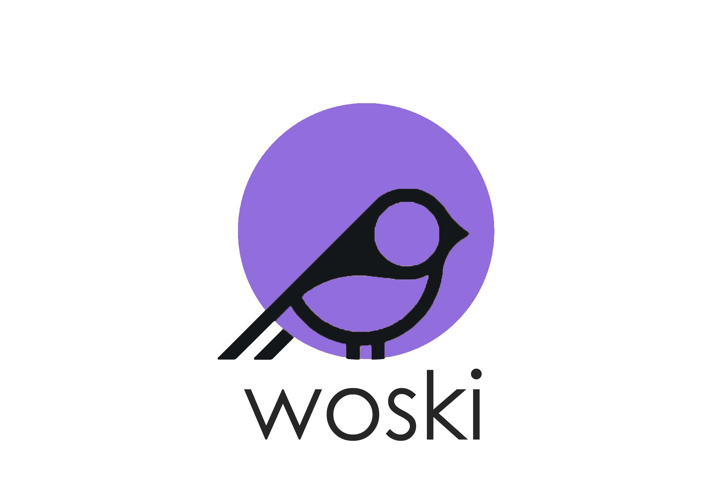

 <p align="center"></p>
 
 <p align="center">	
  	 Woski is a simple fast PHP framework for the Realm
    <br />
    <a href="https://www.woski.xyz" target="_blank"><strong>The Project</strong></a>    <br />
    <br />
  </p>
 </p> 


<br/><br/>

### Installation

Clone the repository

```shell
$ composer create-project clintonnzedimma/woski myApp dev-master
```


### Running your application through Woski CLI
CD into your projects directory and run your application using the command below

```shell
$ php woski --run --port 3030
```

Now you open [http://localhost:3030](http://localhost:3030) in your browser to see your application.

### Your first hello world.
Open your `index.php` file, and add a new route

```php
$app->get('/hello', function ($req, $res) {
    echo 'Hello Realm';
});
```

Visit [http://localhost:3030/hello](http://localhost:3030/hello). You're done.
