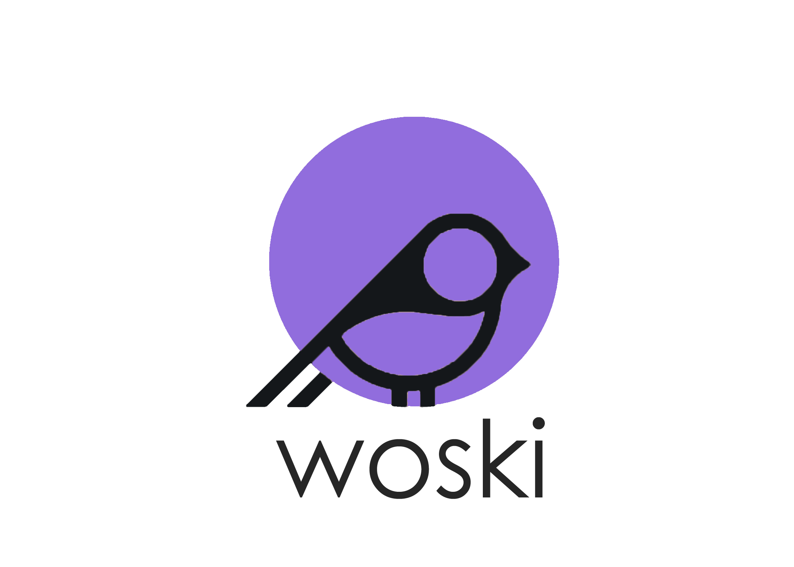

 <p align="center"></p>
 
 <p align="center">	
  	 Woski is a simple fast PHP framework for the Realm
    <br />
    <a href="https://www.woski.xyz" target="_blank"><strong>The Project</strong></a>    <br />
    <br />
  </p>
 </p> 


<br/><br/>
---

## 🚀 Features

- **PSR-4 Autoloading** via Composer  
- **Express-style Routing**  
  - HTTP verbs: `get`, `post`, `put`, `patch`, `delete`, `any`  
  - Route groups: `$app->use('/admin', _import('routes/admin.routes.php'))`  
- **Middleware Pipeline**  
  - Global middleware: `$app->use([$mw->handle])`  
  - Route-specific & group middleware  
  - `Next` / `Block` control flow  
  - Debug logging with `WOSKIPHP_MIDDLEWARE_DEBUG=true`  
- **Error Handling**  
  - Custom 404 handlers per method or global via `$app->error()`  
- **Request & Response Objects**  
  - `$req->body`, `$req->query`, `$req->files`, `$req->cookies`  
  - `$req->hasFile('avatar')`, `$req->isImage('avatar')`  
  - `$res->json()`, `$res->send()`, `$res->sendStatus()`  
- **Input Validation**  
  - `validate($req->body, [...rules...])` with aliases  
- **File Uploads**  
  - Easy retrieval: `Request::file('avatar')`  
- **Configuration & .env**  
  - `env('KEY', $default)` and `config('app.name')` helpers  
  - All core vars prefixed `WOSKIPHP_`  
- **Logging**  
  - `logger()->info()`, `warning()`, `error()`, `debug()` → `storage/logs/woski.log`  
- **CLI Tooling** (`php woski ...`)  
  - `--run [--port=]` → quick dev server  
  - `--make:controller=Name`  
  - `--make:middleware=Name`  
  - `--help`

---

## 📦 Installation

```bash
git clone https://github.com/your-username/woski.git
cd woski
composer install
cp .env.example .env        # configure as needed
mkdir -p storage/logs        # ensure log folder exists
```

---

## ⚙️ Quick Start

1. **Bootstrap & start:**

   ```php
   // index.php (or public/index.php)
   require 'core/woski.php';

   $app = new Woski\Application;

   // Global middleware example
   // $app->use([$demoMW->handle]);

   // Basic route
   $app->get('/', [$homeController->index]);

   // Grouped routes
   $app->use('/example', [$demoMW->foo], _import('routes/example.routes.php'));

   // 404 handler
   $app->error(['GET','POST','PUT','PATCH'], function($req, $res) {
       $res->sendStatus(404);
       return $res->json(['error'=>'Not found']);
   });

   $app->start();
   ```

2. **Run dev server:**

   ```bash
   php woski --run           # default port 3000 or WOSKIPHP_PORT
   php woski --run --port=8xxx
   ```

3. **Generate code:**

   ```bash
   php woski --make:controller UserController
   php woski --make:middleware AuthMiddleware
   php woski --make:model User --table=users
   ```

---

## 🛠 Configuration

- Core **.env variables** must be prefixed `WOSKIPHP_`, e.g.:
  ```
  WOSKIPHP_PORT=4000
  WOSKIPHP_MIDDLEWARE_DEBUG=true
  ```
- **config/app.php** returns an array you can access via:
  ```php
  config('app.name');   // "WoskiPHP"
  config('app.debug');  // true/false
  ```

---

## 🔒 Request Validation

```php
$errors = validate($req->body, [
  'email'    => 'required|email:Email Address',
  'password' => 'required|min:6:Password',
]);
if ($errors) {
  return $res->json(['errors'=>$errors], 422);
}
```

---

## 🗂 File Uploads

```php
if ($req->hasFile('avatar') && $req->isImage('avatar')) {
  $file = $req->files['avatar'];
  move_uploaded_file($file['tmp_name'], 'uploads/'.$file['name']);
  return $res->json(['message'=>'Uploaded']);
}
```

---

## 🧑‍💻 Contributing

1. Fork the repo  
2. Create a feature branch (`git checkout -b feature/...`)  
3. Commit your changes (`git commit -m 'Add ...'`)  
4. Push to the branch (`git push`)  
5. Open a Pull Request  

---

## 📄 License

Licensed under the MIT License. See [LICENSE](LICENSE) for details.